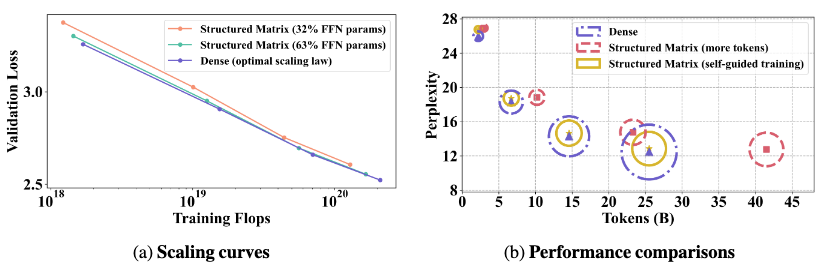

# Building on Efficient Foundations: Effectively Training LLMs with Structured Feedforward Layers

## Introduction
This repository contains the offical implementation for our paper

**Building on Efficient Foundations: Effectively Training LLMs with Structured Feedforward Layers**

Xiuying Wei, Skander Moalla, Razvan Pascanu, Caglar Gulcehre

> In this work, we investigate structured matrices for FFN blocks from the train-from-scratch aspect, first identifying their efficiency and optimization challenges and then presenting experimental results. We consider three efficient linear parametrizations: LowRank, BlockShuffle (comprising two block-diagonal matrices), and BlockDense (a combination of dense and block-diagonal matrices). We propose the pre-merge technique to solve their efficiency bottleneck at the online decoding stage. Then, a training strategy called self-guided training is proposed to improve their training dynamics. Experimental results include the steeper scaling curves of these structured matrices compared to the dense ones on FFN, the improvement brought by self-guided training, and the performance of wide and structured networks when combined with GQA for the attention block.


## File Organization
```
Structured/src/
├── benchmark_acc/                          [training and evaluation entry for different dataset]               
│   └── refinedweb_experiment.py                [refinedweb entry]               
├── benchmark_eff                           [efficiency entry]
│   ├── bench_kernel.py                         [kernel efficiency]   
│   ├── bench_mlp_train.py                            [mlp efficiency]
│   ├── benchmark_model_infer.py                [decoding efficiency]
│   └── benchmark_model_train.py                [prefill/ context efficiency]
├── configs                                 [hydra config]    
│   ├── data                                    [No use. refinedweb is preprocessed in advance]
│   ├── method                                  [different efficient linear layer]
│   ├── model                                   [gpt and llama]
│   ├── optimization                            [optimization including scheduler, optimizer, self-guided training etc.]
│   └── refinedweb_config.yaml                  
├── modules
│   ├── __init__.py
│   ├── op                                       [fast op. Commons ones invoke others or paste from megatron]
│   ├── layer                                    [efficient lineaer layers that invoke functions in op dir]
│   ├── mlp                                      [efficient mlps that invoke functions in layer dir]
│   └── model                                    [supports layernorm or rmsnorm, bias or not, tie we or not, rotary or absolute, gelu or swilu]
├── optimization
│   ├── __init__.py
│   ├── scheduler.py                             [cosine with warmup]
│   └── trainer.py                               [basic training function including seed, checkpoint, and info]
└── utils
    └── refinedweb_llama.py                      [preprocess file]
```

## Env
We use a Docker container for the environment and the GPU type of A100 80G for experiments. The Dockerfile is provided in the experiments folder, where the base image is from Nvidia (nvcr.io/nvidia/pytorch:24.02-py3) with the transformer engine, flash attention, and apex pre-installed. The required Python packages include transformers, wandb, datasets, etc., as listed in the Dockerfile.

## Data preprocess
```
python refinedweb_llama.py --tokenizer llama --block_size 1025 --num_proc=32
```

Refinedweb is quite large. So we shuffle, extract, and tokenize them into token ids in advance. Their token ids are kept in np. memmap to avoid loading data into CPU memory at one time. The above command will randomly split out about 0.7B validation tokens and 65B training tokens for later use.

## Experiments
### Structured linear parametrization (Table 1 and Table 9)
We provide several examples below. We put the whole commands in basic.sh
```
# gpt2 and linear
torchrun --nnodes=1 --nproc_per_node=1 refinedweb_experiment.py model=gpt2 method=linear

# LowRank
torchrun --nnodes=1 --nproc_per_node=1 refinedweb_experiment.py model=gpt2 method=lowrank method.kwargs.rank=384 optimization.max_tokens=2200000000 optimization.optimizer.kwargs.lr=6.0e-4 data.train.train_batch=64 data.test.test_batch=64

# BlockShuffle
torchrun --nnodes=1 --nproc_per_node=1 refinedweb_experiment.py model=gpt2 method=blockshuffle method.kwargs.nblocks=2 optimization.max_tokens=2200000000 optimization.optimizer.kwargs.lr=6.0e-4 data.train.train_batch=64 data.test.test_batch=64

# BlockDense
torchrun --nnodes=1 --nproc_per_node=1 refinedweb_experiment.py model=gpt2 method=blockdense method.kwargs.rank=512 method.kwargs.nblocks=2 optimization.max_tokens=2200000000 optimization.optimizer.kwargs.lr=6.0e-4 data.train.train_batch=64 data.test.test_batch=64
```

### Self-Guided Training (Table 3, 4, and 10)
There are two modes:

  * ablation study that applies the method to the first half of training and incurs 25% extra FFN FLOPs
  
  * experiments with the same training FLOPs to see the straightforward improvement. We use self-guided training for the beginning and repeat this part of tokens at the end to ensure that structured matrices also learn from this data thoroughly. The amount of self-guided training is adjusted to match the training FLOPs.

We provide examples here, and put all the reproducible commands in experiments/sgd.sh
```
# Ablation
torchrun --nnodes=1 --nproc_per_node=1 refinedweb_experiment.py model=gpt2 method=lowrank method.kwargs.rank=192 optimization.max_tokens=2200000000 optimization.optimizer.kwargs.lr=6.0e-4 data.train.train_batch=16 data.test.test_batch=16 optimization/training=self_guided_training optimization.training.kwargs.reduce_flop=true

# to match the flops
torchrun --nnodes=1 --nproc_per_node=1 refinedweb_experiment.py model=gpt2 method=lowrank method.kwargs.rank=192 optimization.max_tokens=2200000000 optimization.optimizer.kwargs.lr=6.0e-4 data.train.train_batch=32 data.test.test_batch=32 optimization/training=self_guided_training optimization.training.kwargs.mode=fixedflop optimization.training.kwargs.reduce_flop=true optimization.training.kwargs.max_step_ratio=0.3
```

### Wide and Structured network (Table 2)
Motivated by the scaling curves, we make the wide model structured with LowRank for FFN and GQA for attention block.

Transformer-m
```
# GQA
torchrun --nnodes=1 --nproc_per_node=1 refinedweb_experiment.py  model=gpt2m method=linear model.kwargs.num_kv_heads=4 model.kwargs.ffn_dim=4864 data.train.train_batch=32 data.test.test_batch=32 optimization.max_tokens=6700000000 optimization.optimizer.kwargs.lr=3.0e-4

# Ours
torchrun --nnodes=1 --nproc_per_node=1 refinedweb_experiment.py   model=gpt2m method=lowrank method.kwargs.rank=512 model.kwargs.hidden_dim=1024 model.kwargs.ffn_dim=4864 model.kwargs.attn_dim=512 model.kwargs.num_q_heads=8 model.kwargs.num_kv_heads=4 data.train.train_batch=32 data.test.test_batch=32 optimization.optimizer.kwargs.lr=3.0e-4 optimization.max_tokens=10580000000

# Ours (self-guided training)
torchrun --nnodes=1 --nproc_per_node=1 refinedweb_experiment.py    model=gpt2m method=lowrank method.kwargs.rank=512 model.kwargs.hidden_dim=1024 model.kwargs.ffn_dim=4864 model.kwargs.attn_dim=512 model.kwargs.num_q_heads=8 model.kwargs.num_kv_heads=4 optimization.optimizer.kwargs.lr=3.0e-4 optimization.max_tokens=6700000000 optimization/training=self_guided_training optimization.training.kwargs.mode=fixedflop optimization.training.kwargs.reduce_flop=true optimization.training.kwargs.max_step_ratio=0.40
```

Transformer-l
```
# GQA
torchrun --nnodes=1 --nproc_per_node=1 refinedweb_experiment.py model=gpt2l method=linear model.kwargs.num_kv_heads=2 model.kwargs.ffn_dim=7424 data.train.train_batch=8 data.test.test_batch=8 optimization.max_tokens=14580000000 optimization.optimizer.kwargs.lr=0.00025

# Ours
# we keep the KV Channels to be 256, aligning with what we used in GQA.
torchrun --nnodes=1 --nproc_per_node=1 refinedweb_experiment.py  model=gpt2l method=lowrank method.kwargs.rank=768 model.kwargs.hidden_dim=1536 model.kwargs.ffn_dim=7424 model.kwargs.attn_dim=768 model.kwargs.num_q_heads=12 model.kwargs.num_kv_heads=4 data.train.train_batch=16 data.test.test_batch=16 optimization.optimizer.kwargs.lr=2.5e-4 optimization.max_tokens=23360000000

# Ours (self-guided training)
torchrun --nnodes=1 --nproc_per_node=1 refinedweb_experiment.py model=gpt2l method=lowrank method.kwargs.rank=768 model.kwargs.hidden_dim=1536 model.kwargs.ffn_dim=7424 model.kwargs.attn_dim=768 model.kwargs.num_q_heads=12 model.kwargs.num_kv_heads=4 optimization.optimizer.kwargs.lr=2.5e-4 optimization.max_tokens=14580000000 optimization/training=self_guided_training optimization.training.kwargs.mode=fixedflop optimization.training.kwargs.reduce_flop=true optimization.training.kwargs.max_step_ratio=0.395
```

### Citation
If you find this repo useful for your research, please consider citing the paper:
```
@article{wei2024building,
  title={Building on Efficient Foundations: Effectively Training LLMs with Structured Feedforward Layers},
  author={Wei, Xiuying and Moalla, Skander and Pascanu, Razvan and Gulcehre, Caglar},
  journal={arXiv preprint arXiv:2406.16450},
  year={2024}
}

@article{wei2024investigating,
  title={Investigating Low-Rank Training in Transformer Language Models: Efficiency and Scaling Analysis},
  author={Wei, Xiuying and Moalla, Skander and Pascanu, Razvan and Gulcehre, Caglar},
  journal={arXiv preprint arXiv:2407.09835},
  year={2024}
}

```
